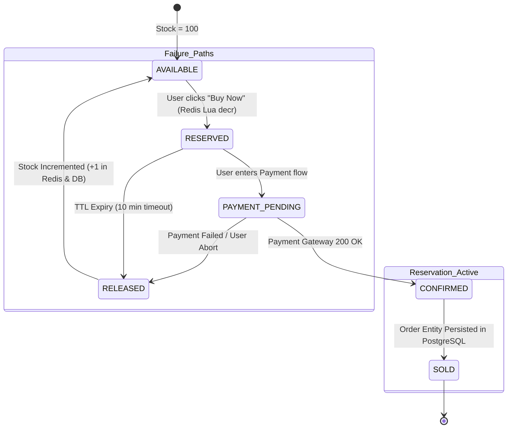

# 05. High Concurrency & Inventory Reservation Mechanism

## 1. The Core Concurrency Challenge
* **Scenario:** 10,000 concurrent purchase requests hit the system at the exact same millisecond ($T_0$) for a flash sale catalog item with only **100 units** in stock.
* **Non-Negotiable Invariant:** $\text{Total Sold} + \text{Currently Reserved} \le 100$. Stock can **NEVER** drop below 0.

---

## 2. Concurrency Control Approach Comparison

| Concurrency Strategy | Latency (p99) | Throughput (QPS) | DB Load | Deadlock Risk | Jury Verdict & Justification |
|---|---|---|---|---|---|
| **Approach 1: Pessimistic DB Row Lock (`SELECT ... FOR UPDATE`)** | $450\text{ms} - 2500\text{ms}$ | $\sim 200\text{ QPS}$ | Extreme (10,000 connections queued) | **High** (Row-level lock contention) | **Rejected:** Starves DB connection pool; causes cascading 504 gateway timeouts. |
| **Approach 2: Optimistic DB Lock (`version = version + 1`)** | $300\text{ms} - 1200\text{ms}$ | $\sim 500\text{ QPS}$ | Very High (9,900 failed retry queries) | Low | **Rejected:** 99% of concurrent write retries fail and waste compute. |
| **Approach 3: Redis In-Memory Atomic Lua Script (Selected)** | **$< 5\text{ms}$** | **$> 80,000\text{ QPS}$** | **Zero** during initial burst | **Zero** (Single-threaded atomic execution) | **SELECTED:** Deterministic, non-blocking, sub-millisecond atomic evaluation. |

---

## 3. Selected Architecture: Two-Phase Atomic Reservation



---

## 4. Production Redis Lua Script for Atomic Reservation

To guarantee that inventory checks and decrements occur atomically in a single CPU execution cycle without race conditions:

```lua
-- KEYS[1]: product_stock_key       (e.g., "stock:prod_1001")
-- KEYS[2]: reservation_hash_key    (e.g., "resv:prod_1001")
-- KEYS[3]: idempotency_key         (e.g., "idemp:req_abc123")
-- ARGV[1]: user_id                 (e.g., "usr_9981")
-- ARGV[2]: request_qty             (e.g., 1)
-- ARGV[3]: reservation_id          (e.g., "res_uuid_777")
-- ARGV[4]: ttl_seconds             (e.g., 600)

-- 1. Check Idempotency: Return existing reservation if already executed
local existing_resv = redis.call('GET', KEYS[3])
if existing_resv then
    return {2, existing_resv} -- Code 2: Duplicate request, returning existing reservation
end

-- 2. Check Available Stock
local current_stock = tonumber(redis.call('GET', KEYS[1]) or "0")
local req_qty = tonumber(ARGV[2])

if current_stock >= req_qty then
    -- 3. Atomic Decrement
    redis.call('DECRBY', KEYS[1], req_qty)
    
    -- 4. Store Reservation Metadata
    local resv_data = cjson.encode({
        reservation_id = ARGV[3],
        user_id = ARGV[1],
        qty = req_qty,
        created_at = redis.call('TIME')[1]
    })
    
    redis.call('HSET', KEYS[2], ARGV[3], resv_data)
    
    -- 5. Set Idempotency Key with TTL matching reservation (10 minutes)
    redis.call('SETEX', KEYS[3], tonumber(ARGV[4]), ARGV[3])
    
    -- 6. Set Reservation Expiry Key for TTL eviction tracking
    redis.call('SETEX', "resv_ttl:" .. ARGV[3], tonumber(ARGV[4]), ARGV[3])
    
    return {1, ARGV[3]} -- Code 1: Success
else
    return {0, "OUT_OF_STOCK"} -- Code 0: Sold Out
end
```

---

## 5. Reservation Expiry & Auto-Release Engine (TTL Management)

How the system handles unpaid reservations after **10 minutes (600s)**:

```mermaid
sequenceDiagram
    autonumber
    participant Redis as Redis Cluster
    participant Sweeper as Expiry Sweeper Worker (Go/Rust)
    participant Kafka as Kafka Broker
    participant DB as PostgreSQL DB

    Note over Redis: Key `resv_ttl:res_123` expires after 600 seconds
    Redis->>Sweeper: Redis Keyspace Notification `__keyevent@0__:expired` (resv_ttl:res_123)
    Sweeper->>Redis: Atomic Lua: Check if status == RESERVED; if so, INCRBY stock 1
    Sweeper->>DB: UPDATE inventory_reservations SET status='EXPIRED' WHERE id='res_123'
    Sweeper->>Kafka: Publish `inventory.released` Event
    Note over Sweeper: Stock is instantly made available to waiting customers
```

### Sweeper Redundancy Mechanism
In addition to Redis keyspace notifications (which are pub/sub best-effort), a scheduled cron sweeper runs every **30 seconds** querying PostgreSQL:
```sql
SELECT reservation_id, product_id, quantity 
FROM inventory_reservations 
WHERE status = 'RESERVED' 
  AND expires_at < NOW() 
LIMIT 500 FOR UPDATE SKIP LOCKED;
```
This guarantees that **no stock is ever leaked** even in the event of a Redis node failover.
