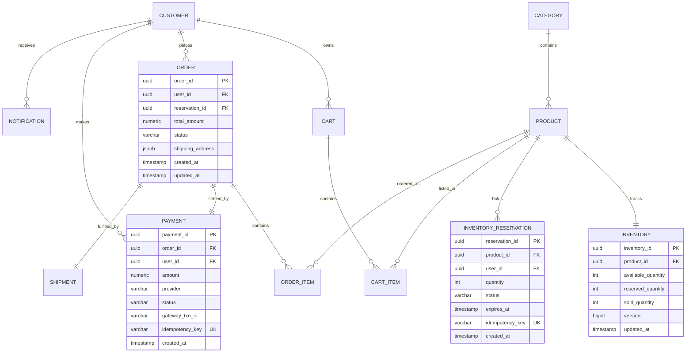

# 07. Database Design, Schemas & Transaction Boundaries

## 1. Entity Relationship (ER) Diagram



---

## 2. Production PostgreSQL DDL Schemas & Constraints

```sql
-- Core Inventory Ledger Table with Versioning for Optimistic Concurrency Control
CREATE TABLE inventory (
    inventory_id UUID PRIMARY KEY DEFAULT gen_random_uuid(),
    product_id UUID NOT NULL UNIQUE,
    available_quantity INT NOT NULL CHECK (available_quantity >= 0),
    reserved_quantity INT NOT NULL DEFAULT 0 CHECK (reserved_quantity >= 0),
    sold_quantity INT NOT NULL DEFAULT 0 CHECK (sold_quantity >= 0),
    version BIGINT NOT NULL DEFAULT 0,
    updated_at TIMESTAMP WITH TIME ZONE DEFAULT CURRENT_TIMESTAMP
);

-- Concurrency-Safe Inventory Reservations Table
CREATE TABLE inventory_reservations (
    reservation_id UUID PRIMARY KEY DEFAULT gen_random_uuid(),
    product_id UUID NOT NULL REFERENCES inventory(product_id),
    user_id UUID NOT NULL,
    quantity INT NOT NULL CHECK (quantity > 0),
    status VARCHAR(32) NOT NULL DEFAULT 'RESERVED', 
    -- Statuses: RESERVED, PAYMENT_PENDING, CONFIRMED, EXPIRED, RELEASED, SOLD
    expires_at TIMESTAMP WITH TIME ZONE NOT NULL,
    idempotency_key VARCHAR(128) NOT NULL UNIQUE,
    created_at TIMESTAMP WITH TIME ZONE DEFAULT CURRENT_TIMESTAMP
);

-- Orders Table
CREATE TABLE orders (
    order_id UUID PRIMARY KEY DEFAULT gen_random_uuid(),
    user_id UUID NOT NULL,
    reservation_id UUID NOT NULL UNIQUE REFERENCES inventory_reservations(reservation_id),
    total_amount NUMERIC(12, 2) NOT NULL CHECK (total_amount >= 0),
    status VARCHAR(32) NOT NULL DEFAULT 'CREATED',
    -- Statuses: CREATED, PAYMENT_PENDING, CONFIRMED, PROCESSING, SHIPPED, OUT_FOR_DELIVERY, DELIVERED, CANCELLED
    shipping_address JSONB NOT NULL,
    created_at TIMESTAMP WITH TIME ZONE DEFAULT CURRENT_TIMESTAMP,
    updated_at TIMESTAMP WITH TIME ZONE DEFAULT CURRENT_TIMESTAMP
);

-- Payments Table with Idempotency Protection
CREATE TABLE payments (
    payment_id UUID PRIMARY KEY DEFAULT gen_random_uuid(),
    order_id UUID NULL REFERENCES orders(order_id),
    user_id UUID NOT NULL,
    amount NUMERIC(12, 2) NOT NULL CHECK (amount > 0),
    currency VARCHAR(3) NOT NULL DEFAULT 'USD',
    provider VARCHAR(32) NOT NULL, -- STRIPE, RAZORPAY, ADYEN
    status VARCHAR(32) NOT NULL, -- INITIALIZED, PROCESSING, SUCCESS, FAILED, REFUNDED
    gateway_txn_id VARCHAR(128),
    idempotency_key VARCHAR(128) NOT NULL UNIQUE,
    created_at TIMESTAMP WITH TIME ZONE DEFAULT CURRENT_TIMESTAMP,
    updated_at TIMESTAMP WITH TIME ZONE DEFAULT CURRENT_TIMESTAMP
);

-- Transactional Outbox Table for Guaranteed Message Dispatch to Kafka
CREATE TABLE transactional_outbox (
    outbox_id UUID PRIMARY KEY DEFAULT gen_random_uuid(),
    aggregate_type VARCHAR(64) NOT NULL,
    aggregate_id VARCHAR(64) NOT NULL,
    event_type VARCHAR(64) NOT NULL,
    payload JSONB NOT NULL,
    status VARCHAR(16) NOT NULL DEFAULT 'PENDING',
    created_at TIMESTAMP WITH TIME ZONE DEFAULT CURRENT_TIMESTAMP
);
```

---

## 3. High-Performance Indexing Strategy

```sql
-- 1. Accelerate high-concurrency reservation status lookups
CREATE INDEX idx_inv_resv_status_expires 
ON inventory_reservations(status, expires_at) 
WHERE status = 'RESERVED';

-- 2. Fast retrieval of user order histories
CREATE INDEX idx_orders_user_created 
ON orders(user_id, created_at DESC);

-- 3. Idempotency fast-path lookups
CREATE INDEX idx_payments_idemp_key 
ON payments(idempotency_key);

-- 4. Outbox polling index for Debezium / Poller
CREATE INDEX idx_outbox_pending 
ON transactional_outbox(created_at) 
WHERE status = 'PENDING';
```

---

## 4. Transaction Boundaries & Isolation Guarantees

* **Inventory Ledger Update Isolation:** `READ COMMITTED` combined with atomic decrement checks `WHERE available_quantity >= req_qty` to prevent dirty reads and lost updates while maximizing transaction throughput.
* **Order Creation Transaction Boundary:**
  ```sql
  BEGIN;
    INSERT INTO orders (order_id, user_id, reservation_id, total_amount, status) VALUES (...);
    UPDATE inventory_reservations SET status = 'CONFIRMED' WHERE reservation_id = '...';
    INSERT INTO transactional_outbox (aggregate_type, aggregate_id, event_type, payload) VALUES ('ORDER', '...', 'order.confirmed', '...');
  COMMIT;
  ```
  *(Atomically writes the order, marks reservation as confirmed, and records the outbox event in one atomic ACID boundary)*.
