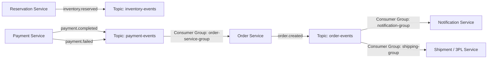

# 09. Event-Driven Architecture, Kafka Topics & Schemas

## 1. Event Streaming Architecture Overview
SALESTORM uses **Apache Kafka** as its central distributed backbone. Decoupled microservices communicate through asynchronous, immutable domain events following the **CloudEvents v1.0** standard.



---

## 2. Kafka Topic Topography & Partitioning Strategy

| Topic Name | Partitions | Partition Key | Retention Policy | Consumers |
|---|---|---|---|---|
| `inventory.events` | 16 | `product_id` | 7 Days (Compacted) | Analytics, Inventory Ledger Sync |
| `payment.events` | 32 | `reservation_id` | 14 Days (Delete) | Order Service, Reservation Sweeper |
| `order.events` | 32 | `order_id` | 30 Days (Delete) | Fulfilment, Notifications, Invoicing |
| `dead-letter-queue` | 8 | `correlation_id` | 90 Days (Manual Review) | Ops Alerting, DLQ Worker |

> [!IMPORTANT]
> **Partition Key Principle:** Events concerning the same `product_id` or `order_id` always map to the **same Kafka partition**, ensuring strict FIFO ordering per entity without requiring global locking.

---

## 3. Domain Event Schemas (CloudEvents JSON)

### 3.1 Event: `payment.completed`
```json
{
  "specversion": "1.0",
  "type": "com.salestorm.payment.completed",
  "source": "/payment-service/production",
  "id": "evt_7718a209-11ba",
  "time": "2026-10-05T12:00:04.120Z",
  "datacontenttype": "application/json",
  "data": {
    "payment_id": "pay_99281a00",
    "reservation_id": "res_88291a-f732-4d11-82e1",
    "user_id": "usr_550291",
    "product_id": "9b1deb4d-3b7d-4bad-9bdd-2b0d7b3dcb6d",
    "quantity": 1,
    "amount": 499.99,
    "currency": "USD",
    "gateway_transaction_id": "ch_3Nq8XYZ89213"
  }
}
```

### 3.2 Event: `inventory.released`
```json
{
  "specversion": "1.0",
  "type": "com.salestorm.inventory.released",
  "source": "/reservation-service/production",
  "id": "evt_8831b310-22cb",
  "time": "2026-10-05T12:10:00.050Z",
  "datacontenttype": "application/json",
  "data": {
    "reservation_id": "res_88291a-f732-4d11-82e1",
    "product_id": "9b1deb4d-3b7d-4bad-9bdd-2b0d7b3dcb6d",
    "quantity": 1,
    "reason": "TTL_EXPIRATION"
  }
}
```

---

## 4. Dead Letter Queue (DLQ) & Poison Pill Handling

```mermaid
flowchart TD
    Msg[Kafka Message: payment.completed] --> Consumer[Order Service Consumer]
    Consumer --> Process{Process & Insert to DB}
    Process -->|Success| Ack[Commit Kafka Offset]
    Process -->|Transient DB Error| Retry[Retry with Exponential Backoff (3 Max)]
    Retry -->|Retry Succeeds| Ack
    Retry -->|Retry Exhausted| RouteDLQ[Publish to payment.completed.DLQ]
    RouteDLQ --> Alert[Trigger PagerDuty Severity 1 Alert]
    RouteDLQ --> DLQWorker[Reconciliation Worker Attempts Auto-Healing]
```
