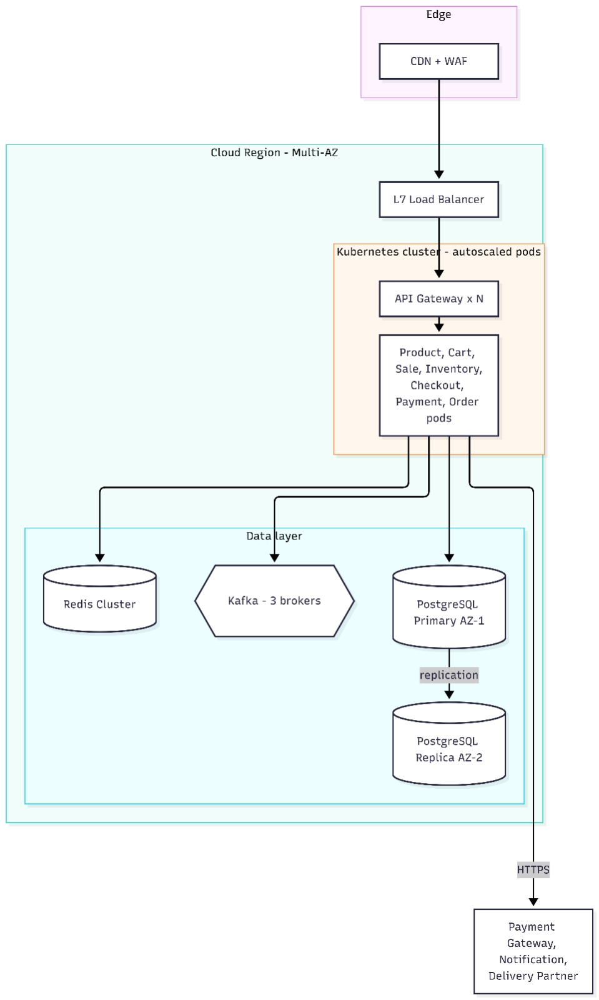
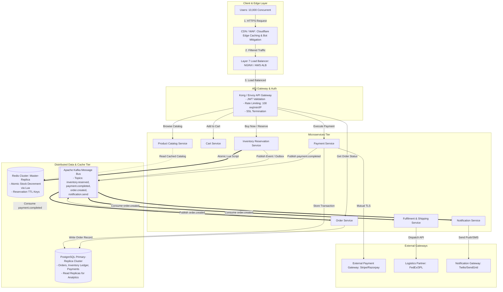

# 03. High-Level Architecture Design (HLD)

## 1. High-Level Architecture Overview
SALESTORM is designed as a **hybrid event-driven microservices architecture** optimized for flash-sale peak loads. It decouples synchronous, low-latency user reservation paths from asynchronous, resilient order processing workflows.

---

## 2. Visual Architecture Diagrams

### 2.1 Service Architecture Diagram


### 2.2 Deployment Diagram


---

## 3. End-to-End System Architecture (C4 Container View)



---

## 4. Synchronous vs. Asynchronous Communication Boundaries

```
[SYNCHRONOUS PATH (Ultra Low Latency < 50ms)]
Client ──► API GW ──► Reservation Service ──► Redis (Lua Atomic Decr) ──► 201 Created (Token)

[ASYNCHRONOUS WORKFLOW (High Resiliency & Eventual Consistency)]
Payment Success ──► Kafka Topic (payment.completed) ──► Order Service ──► DB Persist ──► Notification
```

| Path | Protocol | Justification |
|---|---|---|
| **Catalog Browsing** | HTTP/2 (Sync) | Read-heavy, heavily cached in CDN & Redis. Sub-10ms response time. |
| **Inventory Reservation** | HTTP/2 $\to$ In-Memory Redis (Sync) | Immediate feedback is mandatory for the user experience. |
| **Payment Gateway Interaction** | HTTPS (Sync with Circuit Breaker) | Client requires immediate payment authorization status. |
| **Order Creation & Invoicing** | Event-Driven / Kafka (Async) | Protects Order DB from write starvation; decouples order creation from payment latency. |
| **Shipping & Notifications** | Event-Driven / Kafka (Async) | Third-party latency (FedEx/Twilio) must never block user checkout flow. |

---

## 5. Architectural Component Justification & Bottleneck Elimination

| Component | Why it Exists | Bottleneck Mitigated |
|---|---|---|
| **CDN / Edge WAF** | Terminates TLS, caches static assets & catalog reads, filters malicious bot traffic. | Prevents DDoS attacks and offloads 90% of read traffic from origin servers. |
| **API Gateway (Kong/Envoy)** | Centralized routing, JWT authentication, and distributed token bucket rate limiting. | Protects backend microservices from connection exhaustion and unauthenticated floods. |
| **Redis In-Memory Engine** | Single-threaded atomic script execution for inventory counter and TTL expiration keys. | Eliminates relational DB row-lock contention where 10,000 concurrent writes choke 1 row. |
| **Transactional Outbox + Kafka** | Guaranteed at-least-once message delivery without distributed two-phase commits (2PC). | Prevents dual-write inconsistencies between PostgreSQL database and Kafka broker. |
| **PostgreSQL Primary/Replica** | ACID persistence for immutable ledgers, order history, audit trails, and financial records. | Relieved of flash-sale write spikes; handles confirmed orders smoothly via queue consumers. |
