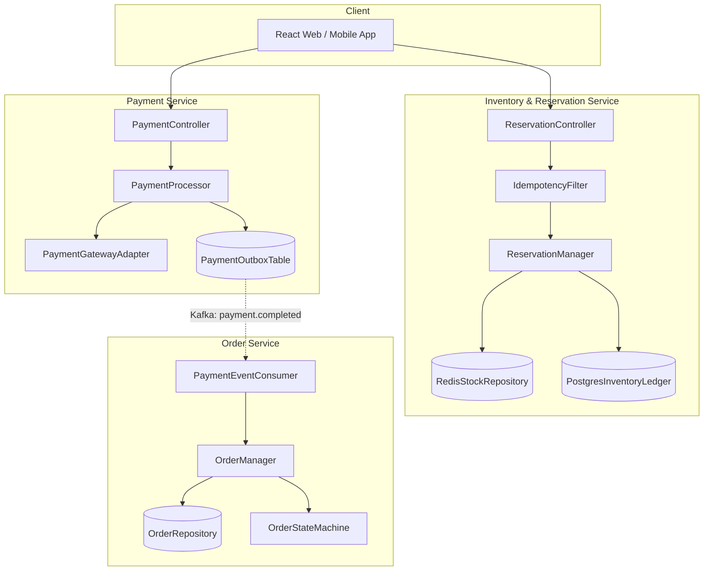
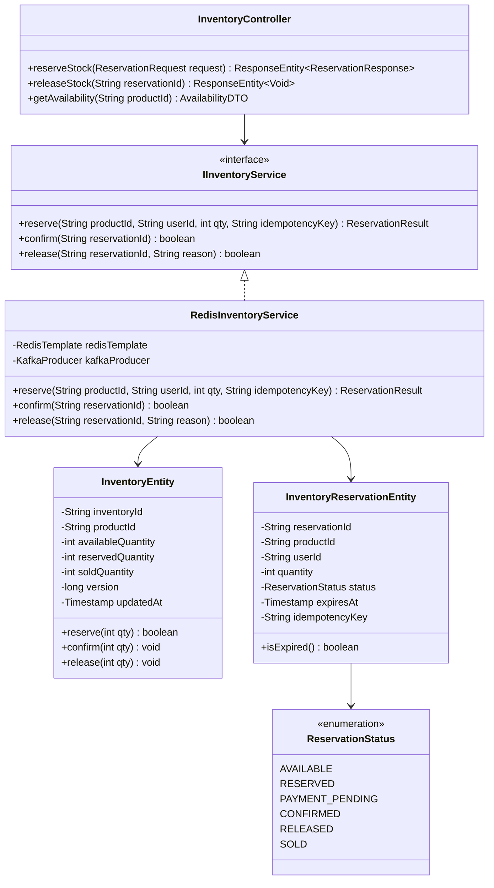
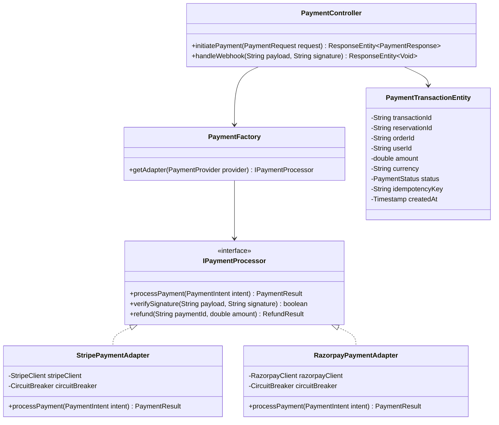
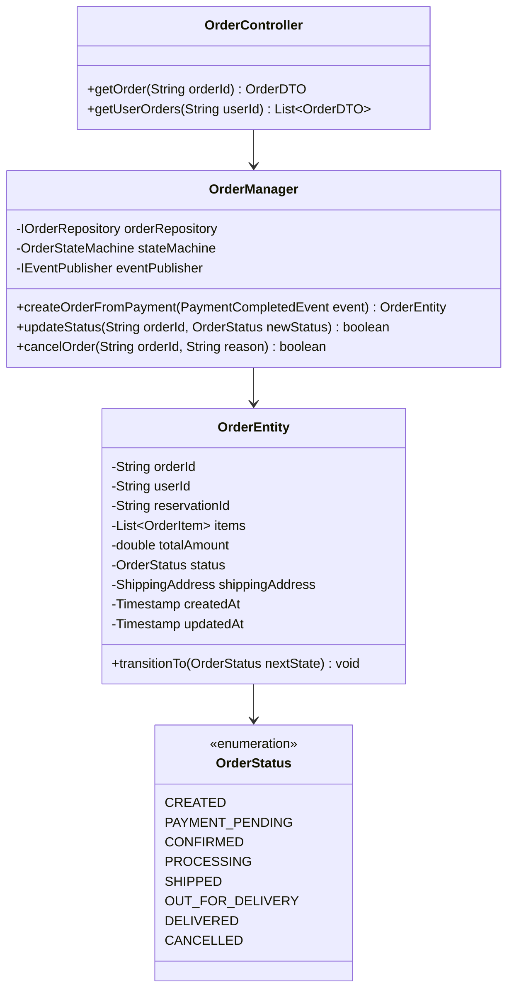
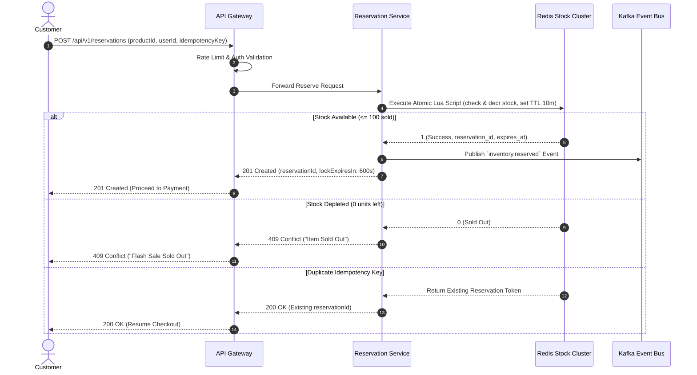
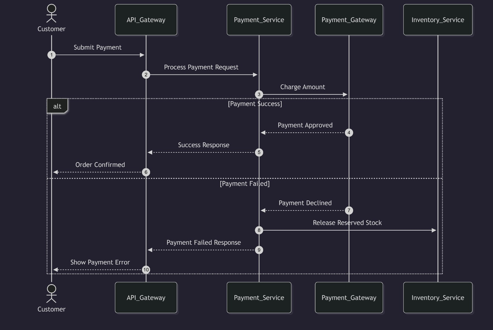
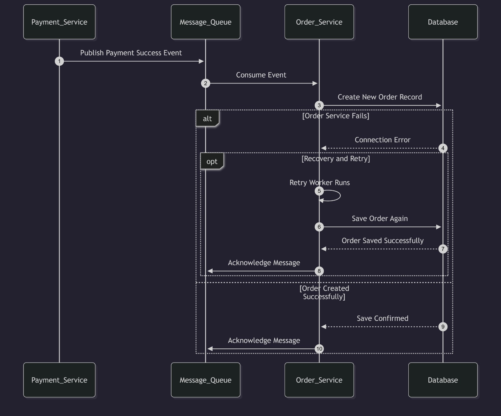
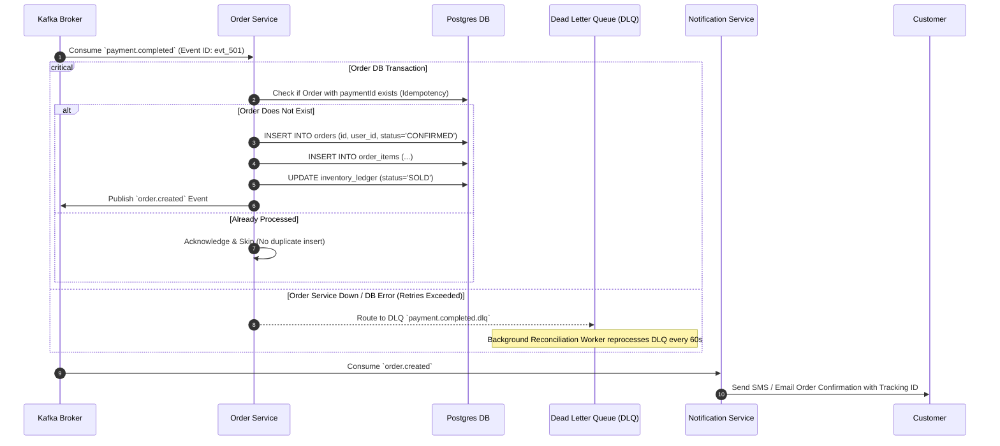

# 04. Low-Level Design (LLD) & UML Specifications

## 1. Overview
This module details the Low-Level Design (LLD) of the three core critical microservices in SALESTORM:
1. **Inventory & Reservation Service**
2. **Payment Service**
3. **Order Management Service**

---

## 2. Component Architecture




---

## 3. Class Diagrams for Critical Modules

### 3.1 Inventory & Reservation Class Diagram




---

### 3.2 Payment Service Class Diagram




---

### 3.3 Order Management Class Diagram




---

## 4. Sequence Diagrams

### 4.1 Purchase & Inventory Reservation Sequence




---

### 4.2 Payment Execution Sequence


```mermaid
sequenceDiagram
    autonumber
    actor Customer
    participant Gateway as API Gateway
    participant PaySvc as Payment Service
    participant PSP as External PSP (Stripe/Razorpay)
    participant DB as Postgres (Transactional Outbox)
    participant Kafka as Kafka Broker

    Customer->>Gateway: POST /api/v1/payments (reservationId, token, idempotencyKey)
    Gateway->>PaySvc: Validate & Forward Payment
    PaySvc->>DB: Check Idempotency Key in `payments` Table

    alt Payment Key Already Exists
        DB-->>PaySvc: Return Cached Status (SUCCESS/FAILED)
        PaySvc-->>Gateway: 200 OK (Cached Result)
        Gateway-->>Customer: 200 OK
    else New Payment Request
        PaySvc->>PSP: Authorize & Capture Charge (mTLS + Timeout 3s)
        alt PSP Success
            PSP-->>PaySvc: 200 OK (charge_id: "ch_98432")
            PaySvc->>DB: BEGIN TX: Insert `payment_transaction` + Outbox Event; COMMIT
            PaySvc->>Kafka: Publish `payment.completed` Event
            PaySvc-->>Gateway: 200 OK (Payment Confirmed)
            Gateway-->>Customer: 200 OK (Payment Confirmed)
        else PSP Failed / Declined
            PSP-->>PaySvc: 402 Card Declined
            PaySvc->>DB: Save Payment Status: FAILED
            PaySvc->>Kafka: Publish `payment.failed` Event (Triggers Inventory Release)
            PaySvc-->>Gateway: 402 Payment Required ("Declined")
            Gateway-->>Customer: 402 Error ("Card Declined, Reservation Released")
        else PSP Timeout (Network Drop)
            PaySvc->>PaySvc: Trigger Async PSP Reconciliation Query
            PaySvc-->>Gateway: 202 Accepted ("Processing, result via webhook/polling")
            Gateway-->>Customer: 202 Accepted ("Payment Verification in Progress")
        end
    end
```

---

### 4.3 Order Creation & Resilient Recovery Sequence



