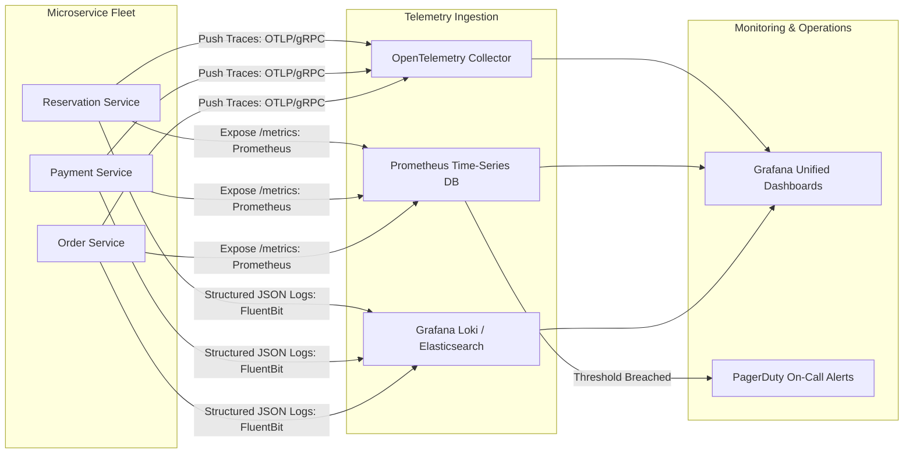
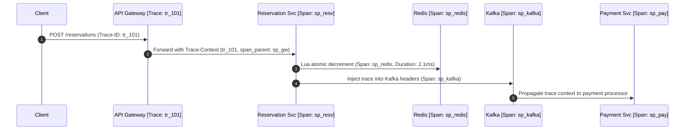

# 16. Observability, Telemetry & Real-Time Alerting

## 1. Observability Architecture (Metrics, Logs, Traces)



---

## 2. Service Level Objectives (SLOs) & Golden Signals

| Golden Signal | Metric Name | Target SLO | Warning Alert Threshold | Critical Alert Threshold |
|---|---|---|---|---|
| **Latency** | `http_request_duration_seconds{quantile="0.99"}` | $< 100\text{ms}$ | $> 150\text{ms}$ for 2m | $> 300\text{ms}$ for 1m |
| **Traffic** | `http_requests_total` | $500,000\text{ QPS}$ | Rate drop $> 50\%$ | Sudden drop $> 90\%$ |
| **Errors** | `http_requests_5xx_ratio` | $< 0.05\%$ | $> 1\%$ for 1m | $> 5\%$ for 30s |
| **Saturation** | `container_cpu_utilization` | $< 70\%$ | $> 75\%$ | $> 90\%$ (Triggers HPA) |
| **Kafka Lag** | `kafka_consumergroup_lag` | $< 1,000\text{ msgs}$ | $> 5,000\text{ msgs}$ | $> 20,000\text{ msgs}$ |
| **Inventory Invariant** | `inventory_consistency_check_violations` | **Strictly 0** | $> 0$ (Immediate SEV-1) | $> 0$ (Automatic Safe-Halt) |

---

## 3. Distributed Tracing Flow with OpenTelemetry

Every user request is tagged with an immutable `X-Correlation-ID` injected at the Edge:



---

## 4. Structured JSON Logging Contract

```json
{
  "@timestamp": "2026-10-05T12:00:01.450Z",
  "level": "INFO",
  "service": "salestorm-payment-service",
  "trace_id": "tr_101a88b901",
  "span_id": "sp_pay_3321",
  "event": "PAYMENT_CAPTURED",
  "user_id": "usr_550291",
  "reservation_id": "res_88291a-f732-4d11-82e1",
  "amount": 499.99,
  "currency": "USD",
  "duration_ms": 312.4,
  "gateway_response_code": "200_OK"
}
```
