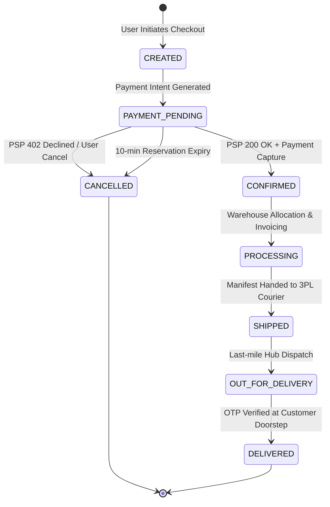
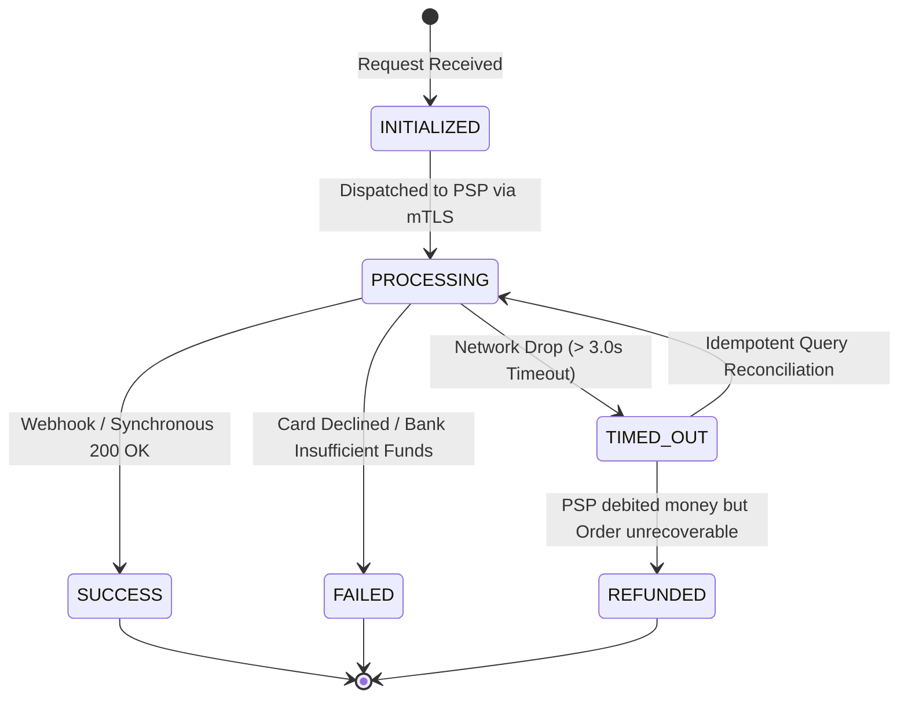
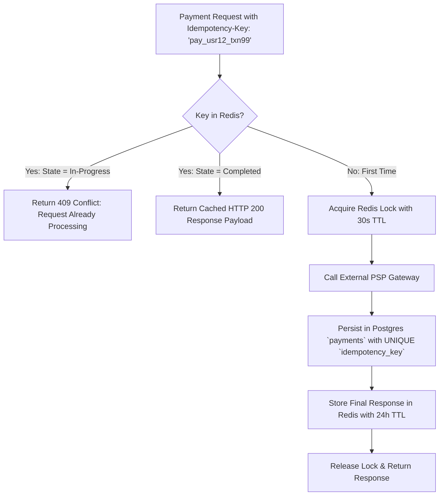
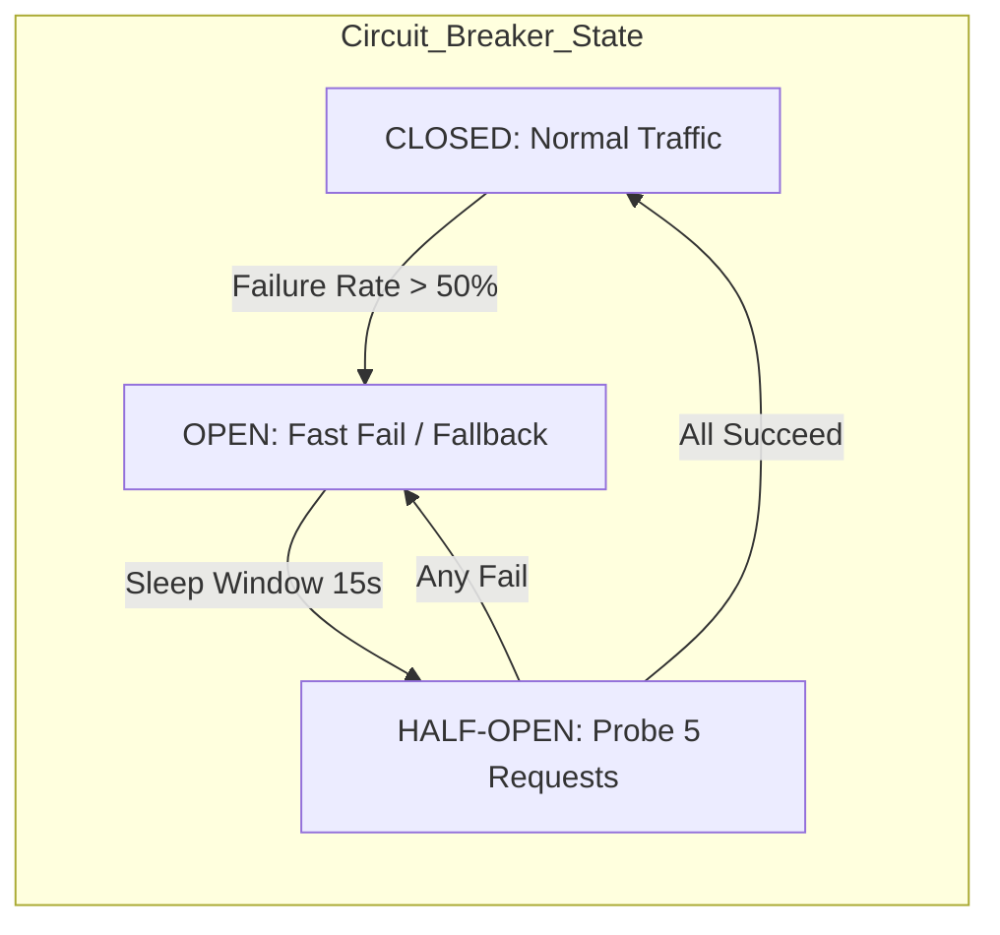

# 06. Payment Reliability & Order Management Workflows

## 1. Overview
In a flash sale, payment processing is the most volatile boundary due to external third-party dependencies (Payment Service Providers / PSPs), banking latencies, network timeouts, and potential downstream microservice crashes.

---

## 2. Order & Payment State Machines

### 2.1 Order State Transition Engine

### 2.2 Payment State Transition Engine

---

## 3. Handling Critical Payment & Order Scenarios

| Scenario | System Response & Mitigation Strategy |
|---|---|
| **Scenario 1: Payment Succeeds** | PSP returns 200 OK. Payment Service atomically writes transaction record and publishes `payment.completed` event to Kafka via Transactional Outbox. Order Service creates `CONFIRMED` order. |
| **Scenario 2: Payment Fails** | PSP returns 402/500 error. Payment Service records `FAILED` status, releases the Redis & DB reservation immediately, and notifies the customer to retry with another card. |
| **Scenario 3: Payment Times Out** | Client connection drops after 3000ms. Payment Service marks payment `PENDING_RECONCILIATION`. A background worker queries PSP endpoint `GET /v1/charges/{idempotency_key}`. If charged $\to$ confirms order; if not charged $\to$ cancels transaction. |
| **Scenario 4: Duplicate Payment Clicks** | Customer rapidly clicks "Pay" 5 times. API Gateway checks `Idempotency-Key` in Redis cache. First request proceeds; subsequent 4 requests receive HTTP 409 / cached response without invoking PSP. |
| **Scenario 5: Payment Succeeds; Order Service Fails (Crash for 30s)** | Payment Service committed transaction and published to Kafka topic `payment.completed`. Kafka retains messages persistently for 7 days. When Order Service recovers, it resumes reading from its last committed offset and reliably creates all orders with zero data loss. |

---

## 4. Idempotency Implementation Architecture

---

## 5. Circuit Breaker & Retry Policies

### Configured Resilience Rules (Resilience4j / Envoy)
* **Timeout:** Maximum **3000ms** for external PSP calls.
* **Retry Strategy:** Max **3 retries** using **Exponential Backoff with Full Jitter**:
  $$t_{\text{sleep}} = \text{random}(0, \min(M, B \times 2^{\text{attempt}}))$$
  *(where $B = 200\text{ms}$ and $M = 2000\text{ms}$)*.
* **Circuit Breaker Threshold:** If $50\%$ of calls fail in a 20-request sliding window, circuit opens for 15 seconds to prevent cascading thread pool exhaustion.
