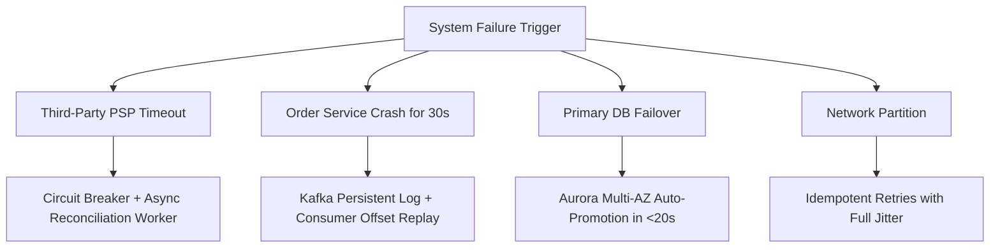
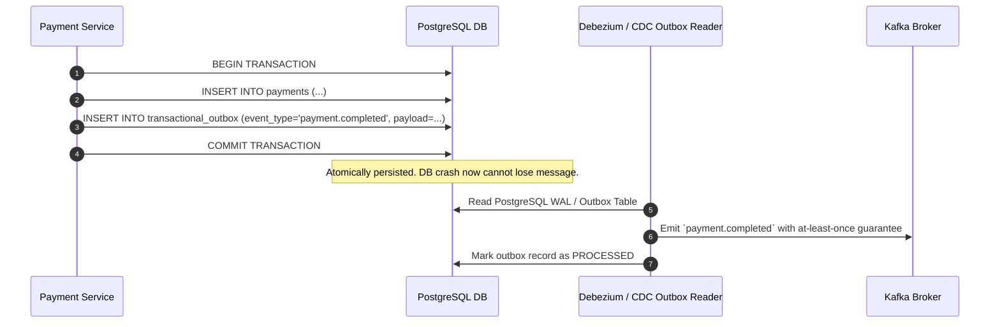

# 14. Reliability, Fault Tolerance & Disaster Recovery

## 1. System Reliability Principles
SALESTORM is designed under the philosophy that **everything can and will fail**. The system prioritizes graceful degradation, self-healing workers, and zero loss of confirmed financial transactions.

---

## 2. Failure Recovery Matrix

| Outage Scenario | Blast Radius | Automated Recovery & Defense Mechanism | Max Data Loss (RPO) | Max Downtime (RTO) |
|---|---|---|---|---|
| **Payment Gateway (PSP) Down / Unresponsive** | Payments failing for ~100 users. | Circuit breaker trips OPEN. Gateway falls back to alternative PSP (e.g. Stripe $\to$ Razorpay) or queues payments for asynchronous verification. | **0 transactions** | $< 2\text{ seconds}$ |
| **Order Service Crashes for 30 Seconds** | Order records delayed in database. | **Zero Impact on Payment:** Payment Service commits to DB and publishes to Kafka. Kafka holds messages in partition. When Order Service restarts, it drains backlogged events seamlessly. | **0 orders lost** | $30\text{ seconds}$ (Lag only) |
| **Primary PostgreSQL Crash** | Read/Write DB Unavailable. | AWS Aurora Multi-AZ promotes Read Replica to Primary within 15 seconds. Active reservations remain safe in Redis memory. | **$< 100\text{ms}$** | $< 20\text{ seconds}$ |
| **Redis Master Node Failure** | Temporary hold on new reservations. | Redis Sentinel / Cluster auto-promotes slave replica in $< 3\text{ seconds}$. AOF persistence ensures stock count is restored. | **0 stock lost** | $< 3\text{ seconds}$ |
| **Network Jitter / Duplicate Client Retries** | Duplicate HTTP calls. | `Idempotency-Key` unique constraints in Redis & PostgreSQL filter repeated invocations automatically. | **0 duplicate charges** | $0\text{ seconds}$ |

---

## 3. Transactional Outbox Pattern for Data Resiliency

---

## 4. Disaster Recovery Targets

* **Recovery Point Objective (RPO):** **0 seconds** for financial transactions and confirmed orders (Synchronous multi-AZ replication & WAL archiving).
* **Recovery Time Objective (RTO):** **$< 30\text{ seconds}$** for automatic microservice pod restarts and database failovers.
