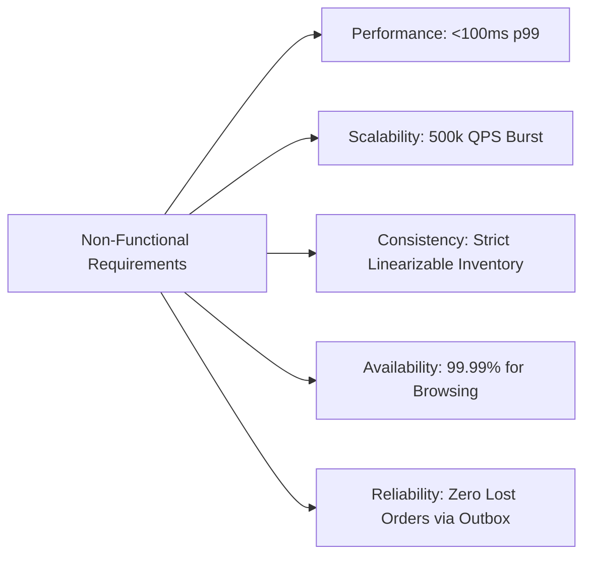

# 01. Requirements & Assumptions Specification

## 1. Business Context & Problem Statement
**SALESTORM** is a high-volume e-commerce platform preparing for flash sales where high customer concurrency collides with strictly limited stock. 

### Critical Flash Sale Scenario:
* **Available Stock:** 100 units of Product X.
* **Concurrent Traffic:** 10,000 simultaneous users clicking "Buy Now" at $T_0$.
* **Core Challenge:** Ensure strictly zero overselling (never sell >100 units), prevent duplicate reservations/charges, handle payment gateway timeouts, and guarantee reliable order creation even during downstream service failures.

---

## 2. Functional Requirements (FR)

| ID | Requirement | Description | Criticality |
|---|---|---|---|
| **FR-01** | **Product Discovery & Browsing** | Users can search, view catalog details, dynamic pricing, and live availability status. | High |
| **FR-02** | **High-Concurrency Flash Reservation** | Atomically reserve 1 unit of stock upon "Buy Now" request without overselling. | **Critical (P0)** |
| **FR-03** | **Temporary Reservation TTL** | Held inventory expires automatically in **10 minutes** if checkout/payment is not completed. | **Critical (P0)** |
| **FR-04** | **Idempotent Checkout & Payment** | Repeated submissions or network retries MUST NEVER cause duplicate reservations or double charges. | **Critical (P0)** |
| **FR-05** | **Order Lifecycle Management** | Complete lifecycle tracking: `CREATED` $\to$ `PAYMENT_PENDING` $\to$ `CONFIRMED` $\to$ `PROCESSING` $\to$ `SHIPPED` $\to$ `OUT_FOR_DELIVERY` $\to$ `DELIVERED`. | **Critical (P0)** |
| **FR-06** | **Graceful Failure & Release** | On payment failure or user cancellation, reserved stock is released back into available inventory immediately. | **Critical (P0)** |
| **FR-07** | **Fulfilment & Notification** | Asynchronous events trigger shipment dispatch, invoice generation, and real-time SMS/Email updates. | Medium |

---

## 3. Non-Functional Requirements (NFR)

### 3.1 Strict Guarantees vs. Target Goals

| Category | Strict Guarantee (P0) | Target Goal (P1/P2) |
|---|---|---|
| **Inventory Consistency** | **Linearizable Consistency:** Exactly 100 units sold. Zero negative inventory. | Cache eventual consistency $\le 500\text{ms}$ for catalog read view. |
| **Payment Safety** | **Strict Idempotency:** Exactly-once financial charge per order intent. | Payment confirmation roundtrip $< 1.5\text{s}$. |
| **Order Durability** | **At-Least-Once Delivery with Idempotent Processing:** Zero lost orders after payment. | End-to-end async order generation $< 2\text{s}$. |
| **Latency** | Reservation decision $< 50\text{ms}$ (Redis Atomic Lua). | Product catalog load $< 100\text{ms}$ (CDN Edge cached). |
| **Availability** | Graceful degradation under overload; catalog availability $\ge 99.99\%$. | 99.95% overall end-to-end system uptime. |

---

## 4. System Assumptions & Operational Constraints

1. **Traffic Spike Multiplier:** Flash sale start creates a $50\times$ traffic surge within $500\text{ms}$.
2. **User Behaviour:** 
   * $95\%$ of payment attempts succeed on first try.
   * $5\%$ fail due to insufficient funds, bank rejection, or user abort.
   * $2\%$ of network requests generate duplicate clicks/retries.
3. **Third-Party Payment Latency:** External Payment Service Providers (PSP like Stripe/Razorpay) take between $800\text{ms}$ and $3000\text{ms}$ to respond, with occasional timeouts.
4. **Service Outage Tolerance:** The Order Service may suffer temporary downstream network partitions or restarts (e.g., unavailable for up to 30 seconds) without losing confirmed payments.
5. **Inventory Window:** Maximum reservation hold duration = **600 seconds (10 minutes)**.

---

## 5. End-to-End Required Pipeline

```mermaid
flowchart LR
    A[Customer] --> B[Product Discovery]
    B --> C[Cart / Buy Now]
    C --> D[Inventory Check]
    D --> E[Inventory Reservation]
    E --> F[Checkout]
    F --> G[Payment]
    G --> H[Order Creation]
    H --> I[Fulfilment]
    I --> J[Shipment]
    J --> K[Notification]
    K --> L[Delivery Tracking]
```

