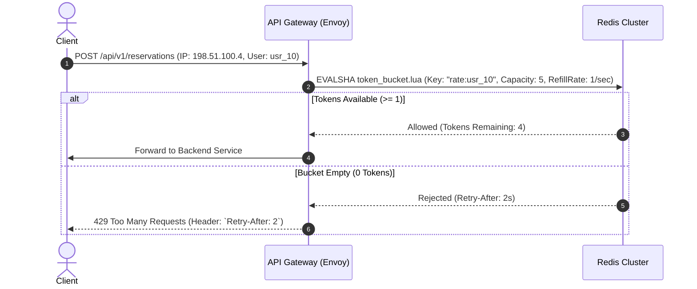

# 15. Security Architecture & Threat Modeling

## 1. Security Architecture Overview
SALESTORM implements a **Zero Trust Security Architecture** with defense-in-depth across the Edge, API Gateway, Service Mesh, and Data tiers.

```mermaid
flowchart TD
    User[Customer Browser / Mobile] -->|1. TLS 1.3 / HTTPS| CDN[Cloudflare WAF + Bot Management]
    CDN -->|2. Validated Traffic| APIGW[API Gateway: JWT RS256 Auth]
    
    subgraph Service_Mesh [Zero Trust Service Mesh (mTLS)]
        APIGW -->|3. mTLS + Spiffe ID| ResvSvc[Reservation Service]
        APIGW -->|3. mTLS + Spiffe ID| PaySvc[Payment Service]
        PaySvc -->|4. Tokenized Token| PSP[Stripe / PCI-DSS Vault]
    end

    subgraph Secrets_Data [Security & Encryption Tier]
        Vault[(HashiCorp Vault / KMS)] -.->|Rotated Secrets| PaySvc
        Audit[(Encrypted Audit Logs / Splunk)]
    end

    PaySvc -.-> Audit
```

---

## 2. Security Threat Matrix & Mitigations

| Threat Vector | Attack Scenario | Architectural Defense in SALESTORM |
|---|---|---|
| **Scalper Bots & Automated Scripts** | Headless scripts spamming "Buy Now" at millisecond $T_0$. | **Cloudflare Bot Management:** Analyzes TLS fingerprinting, device heuristics, and injects managed challenges (Cloudflare Turnstile) if bot score $< 30$. |
| **API Rate Limit Abuse / DDoS** | Single user flooding reservation API with 1,000 req/sec. | **Distributed Token Bucket:** Enforced in Envoy/Kong via Redis. Capped at 5 reservation requests/sec per authenticated user ID. |
| **Payment Fraud / Carding** | Attackers testing stolen credit cards. | **PCI-DSS Tokenization:** SALESTORM never touches, handles, or stores raw PAN / CVV. Direct tokenization handled in customer browser via Stripe Elements SDK. |
| **Replay Attacks** | Capturing and resending valid checkout HTTP payloads. | **Idempotency Keys + Nonce:** Expired or reused tokens rejected immediately by API Gateway. |
| **Lateral Movement in Network** | Compromised catalog container attempting to access payment DB. | **mTLS + Kubernetes Network Policies:** Default deny-all ingress rules. Only Payment Service can communicate with Payment DB. |

---

## 3. Rate Limiting Algorithm (Distributed Token Bucket)



---

## 4. Compliance & Audit Logging
* **PCI-DSS Level 1 Compliance:** Full tokenization with zero cardholder data environment (CDE) footprint on internal servers.
* **Immutable Audit Trail:** All administrative adjustments, stock replenishment, and payment refund actions are written to write-once-read-many (WORM) cloud storage.
