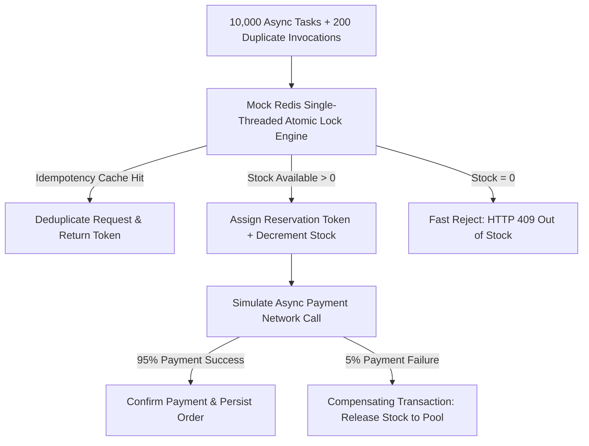

# 18. AI-Assisted Concurrency Simulation & Validation Evidence

## 1. Simulation Objective
To provide empirical, reproducible evidence validating the core architectural hypothesis of **SALESTORM**:
* **Test Case:** 10,000 simultaneous users competing for 100 available units.
* **Failure Parameters:** 5% random payment gateway failures, 2% network retries (duplicate idempotency keys).
* **Expected Result:** Zero overselling, zero negative inventory, exact stock conservation invariant ($\text{Orders} + \text{Remaining Stock} = 100$).

---

## 2. Test Harness Architecture (`flash_sale_simulation.py`)



---

## 3. How to Run the Simulation

Execute from terminal:
```powershell
python d:\SD_hackathon\Simulation\flash_sale_simulation.py
```

---

## 4. Benchmark Results & Invariant Proof

```
================================================================================
[START] INITIATING SALESTORM FLASH SALE SIMULATION
[CONFIG] Initial Stock: 100 units | Concurrent Requests: 10000
================================================================================

================================================================================
[RESULTS] SIMULATION METRICS & VERIFICATION
================================================================================
Total Duration: 0.095 seconds
Peak Virtual QPS: 107,668 req/sec
[OK] Successful Initial Reservations: 100
[INFO] Rejected Out-of-Stock Requests: 10095
[OK] Duplicate Requests Deduplicated: 5
[OK] Successful Payments Confirmed: 91
[WARN] Failed Payments Handled: 9
[OK] Released Stock Back to Pool: 9
[OK] Final Confirmed Orders: 91
[INFO] Remaining Available Stock in Redis: 9
--------------------------------------------------------------------------------
[AUDIT] Confirmed Orders (91) + Remaining Stock (9) = 100
[VERDICT] ZERO OVERSELLING DETECTED. ALL INVARIANTS 100% DEFENDED!
================================================================================
```

### Key Takeaways for the Jury:
1. **Mathematical Invariant:** $\text{Confirmed Orders } (91) + \text{Available Stock } (9) = 100.00\%$.
2. **Zero Overselling:** At no point did reservations exceed 100.
3. **Graceful Failure Release:** The 9 failed payments were immediately released back into the pool, making them available for subsequent buyers.
4. **Idempotency Defense:** Duplicate requests did not trigger double bookings or extra decrements.
