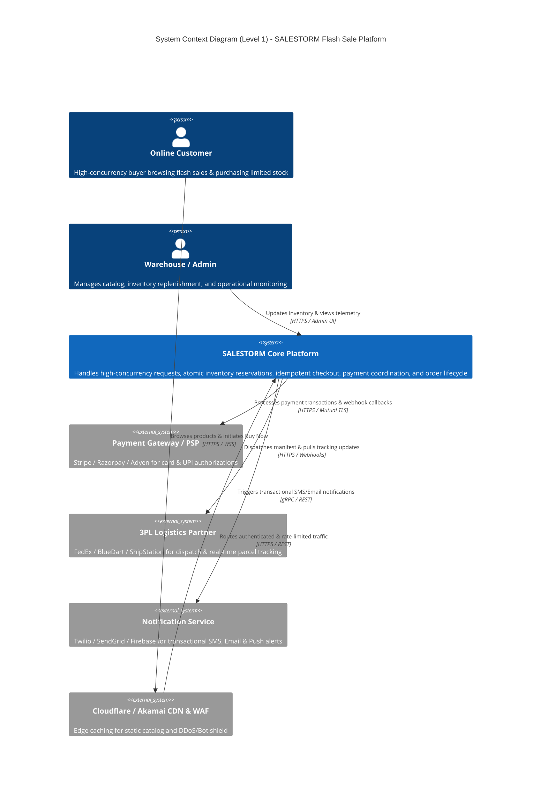

# 02. System Context Design (C4 Level 1)

## 1. System Overview
The **SALESTORM Platform** acts as the core transactional engine coordinating high-velocity customer interactions, distributed payment gateways, shipping logistics partners, and communication providers.

---

## 2. Visual Architecture: System Context

---

## 3. External System Boundaries & Interfaces

| External Entity | Integration Protocol | Failure Recovery Strategy |
|---|---|---|
| **Customer Clients (Web/Mobile)** | HTTPS / REST / SSE | Exponential backoff retry, cached product catalog, optimistic UI updates. |
| **CDN & WAF (Cloudflare/Akamai)** | Anycast DNS / Edge Caching | Edge rate-limiting (Token bucket), WAF bot detection, static page failover. |
| **Payment Gateways (PSP)** | HTTPS / Webhooks / mTLS | Circuit Breaker (Polly/Resilience4j), Async Webhook reconciliation, Idempotency keys. |
| **3PL Logistics Partners** | REST APIs / Webhooks | Asynchronous message queues (Kafka `order-confirmed`), dead-letter queues. |
| **Notification Services** | gRPC / REST | Fire-and-forget async event consumption (`notification-events` topic). |

---

## 4. Key Responsibilities & System Boundaries

* **Inside System Boundary:**
  * Rate limiting & bot filtering.
  * In-memory atomic inventory reservation (Redis Cluster).
  * Transactional persistence & strict data consistency (PostgreSQL).
  * Saga orchestration & state machine execution.
  * Distributed event streaming & Outbox pattern (Kafka).
* **Outside System Boundary:**
  * Banking / card network authorization (handled entirely by external PSPs).
  * Physical packaging and courier transportation (handled by 3PL partners).
  * Cellular SMS & SMTP deliverability (handled by Twilio/SendGrid).
